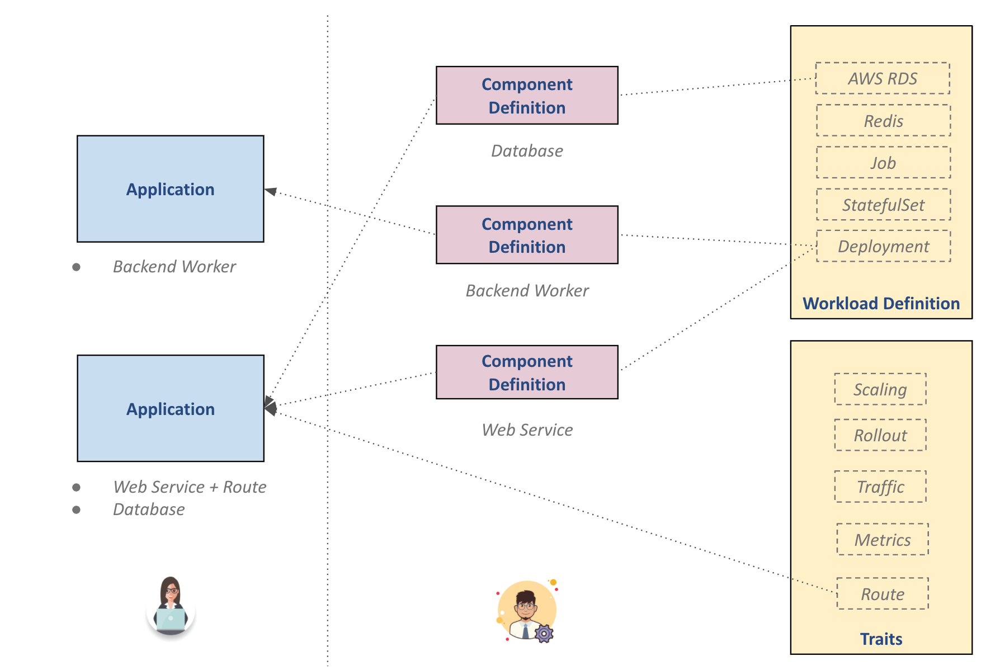

# 4. Workload Types

Using workload type is covered in component model section, but workload type definitions are described here.

Workload type is the key characteristic of a given component definition. Workload types are provided by the platform so that users may inspect the platform and learn what workload types are available for use. Note that workload types are not extensible to end users (only to platform operators). Thus, end users MUST NOT be allowed to create new workload types.

## Workload Definition

The workload type is presented with `WorkloadDefinition`, besides for the discoverability purpose, the workload definition also carries [characteristic information](#characteristics-of-workload-types) which would hint the platform how to attach [traits](6.traits.md) to a given component that references this workload type (i.e. the *applies to* feature of trait system).

### Top-Level Attributes

Here are the attributes that provide top-level information about the workload definition.

| Attribute | Type | Required | Default Value | Description |
|-----------|------|----------|---------------|-------------|
| `apiVersion` | `string` | Y | | A string that identifies the version of the schema the object should have. The core types uses `core.oam.dev/v1beta1` in this version of specification |
| `kind` | `string` | Y || Must be `WorkloadDefinition` |
| `metadata` | [`Metadata`](2.overview_and_terminology.md#metadata) | Y | | Entity metadata. |
| `spec`| [`Spec`](#spec) | Y | | The specification for the workload definition. |

#### Spec

| Attribute | Type | Required | Default Value | Description |
|-----------|------|----------|---------------|-------------|
| `definitionRef` | [`DefinitionRef`](#definitionref) | Y | | Identifier to workload capability in the platform. |

##### DefinitionRef

| Attribute | Type | Required | Default Value | Description |
|-----------|------|----------|---------------|-------------|
| `name` | `string` | N | | Name identifier of the workload capability. Mutually exclusive to `apiVersion` and `kind`.|
| `apiVersion` | `string` | N | | API version of the workload capability. |
| `kind` | `string` | N || Kind of the workload capability. |

## Characteristics of Workload Types

Below reserved `metadata.labels` in workload definition are used to indicates _the distinguishing characteristics_ of the workload type. 

These characteristics will be honored by _applies to_ feature of traits system.

|Label|Type|Explain|
|-|-|-|
|`workload.oam.dev/replicable`|boolean|Whether they are replicable. If not, no replication or scaling traits may be assigned.|
|`workload.oam.dev/daemonized`|boolean|Whether they are daemonized. For daemon types, if the workload exits, this is considered a fault, and the system must fix it. For non-daemonized types, exit is considered a success if no error is reported.|
|`workload.oam.dev/exposed`|boolean|Whether they are exposed, i.e. have a service endpoint with a stable name for network traffic. Workload types that have a service endpoint need a virtual IP address (VIP) with a DNS name to represent the component as a whole, addressable within their network scope and can be assigned traffic routing traits.|
|`workload.oam.dev/podspecable`|boolean|Whether this workload can be addressed by Kubernetes `PodSpec`. If yes, the implementation could manipulate the workload by leveraging `PodSpec` structure, instead of being agnostic of the workload's schematic. |

## Categories of Workload Types

There are several categories of workload types.

### Officially Maintained Workload Type

The officially maintained workload type MUST be in the `oam.dev` group.

Here is an example of an officially maintained workload type:

```yaml
kind: WorkloadDefinition
metadata:
  name: Server
spec:
  definitionRef:
    name: containerizedworkloads.core.oam.dev
```

The specification of this workload type:

|Name|Category|Schema|Exposed|Replicable|Daemonized|
|-|-|-|-|-|-|
|[Server](core/workloads/server.md)|Core|[ContainerizedWorkload](core/workloads/schema/containerized_workload.md)|Yes|Yes|Yes|

### Extended Workload Type

Each OAM runtime may define its own workload types beyond this group and they will be considered an extended workload type. The name and schema of extended workload types are entirely at the discretion of the OAM implementation.

Here is an example of an extended workload:

```yaml
kind: WorkloadDefinition
metadata:
  name: redis.cache.aliyun.com
spec:
  definitionRef:
    name: redis.cache.aliyun.com # this is an extended workload type
```

For the extended workload type, the following conventions are RECOMMENDED:

- Use [Group/Version/Kind](2.overview_and_terminology.md#Group) to uniquely identify the workload capability.
- The `name` follows the format described in [*Group, Version, and Kind*](2.overview_and_terminology.md).
- The `name` of the `WorkloadDefinition` is the same as the `name` to which it refers.

For example:

```yaml
kind: WorkloadDefinition
metadata:
  name: schema.example.com
spec:
  definitionRef:
    name: schema.example.com
```

## The Relationship of Component and Workload Type

In nutshell, a component is a user maintained **encapsulation** for certain platform capabilities and workload type is the key one of them. That's also why a component is required to explicitly declare the workload type in its definition: the trait system need to know this to decide whether a certain trait can be attached to this component.

Below examples may also help to explain their relationships better:

- A `Web Service` component that encapsulates a Kubernetes Deployment + a Service.
  - The `apps/v1.Deployment` is the workload type for this component in this case.
- A `Backend Worker` component that encapsulates a Kubernetes Deployment.
  - The `apps/v1.Deployment` is still the workload type for this component in this case.
- A Helm chart which templates a Kubernetes Deployment + a Ingress is also a component.
  - The `apps/v1.Deployment` is the workload type for this component.



From another angle, the `ComponentDefinition` is always defined by platform user (normally, component provider or software builder), while a `WorkloadDefinition`, as a platform capability, is always maintained by infrastructure operator. Hence, a OAM platform normally has very limited number of workload definitions and they do not change a lot, but always have countless component definitions maintained by different users.

| Previous      | Next        |
| ------------- |-------------|
[3. The Component Model](3.component_model.md) | [5. Application Scopes](5.application_scopes.md)|
