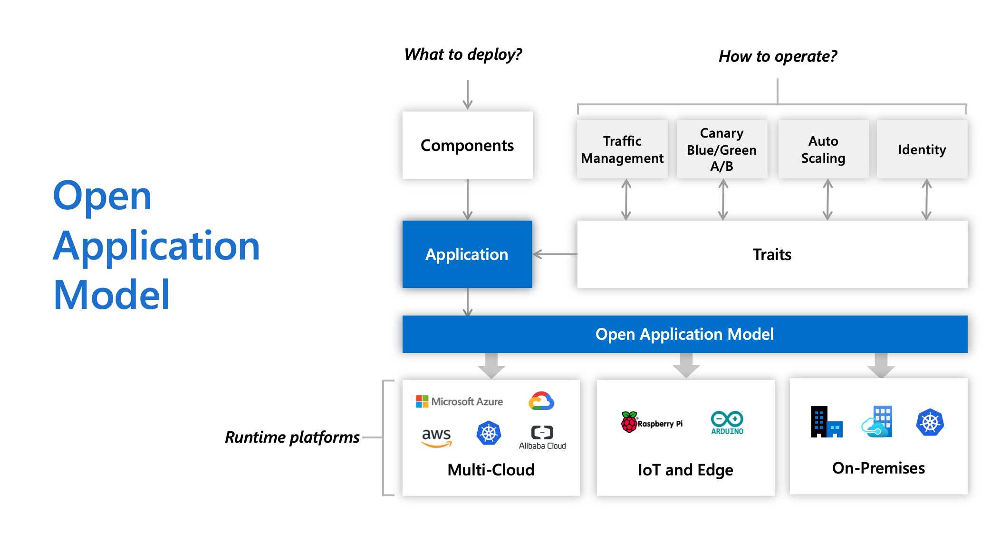

# Open Application Model Specification

Open Application Model (OAM) is a runtime-agnostic specification for defining cloud native applications and enable building application-centric platforms by natural.

Focused on **application** rather than container or orchestrator, _Open Application Model_ brings modular, extensible, and portable design for modeling cloud native applications and enable building application-centric platforms on any runtime infrastructure like Kubernetes, cloud, or IoT devices.

## Introduction

_"Developers think in terms of application architecture, not of infrastructure."_

Open Application Model defines a series of standard but extensible modules to model micro-service applications, with operation features as part of the application definition. This enables platform builders to create application focused systems around a unified model, by developing modularized components and traits, and essentially serve their customers with app-centric mindset by default.

### Why Open Application Model?

Platforms without application context are hard:

- Developers spend time on infrastructure details instead of applications - ingress, labels, iptables rules, DNS, etc, and learning how the platform is implemented.
- Restricted platform capabilities - in-house APIs with opinionated abstractions and implementations, lack of interoperability.
- Runtime lock-in - platform is tightly coupled with execution runtime, which heavily impact on how you configure, develop and operate your application.

In Open Application Model, we propose an app-centric approach instead:

- Application first - build the platform around a self-contained app model, where operational features as part of app definition, free of infrastructure here.
- Clarity and extensibility - an open standard to modularize your platform capabilities into reusable pieces, with freedom to bring your own abstractions and implementations.
- Runtime agnostic - a consistent experience to deploy and operate your apps across on-prem clusters, cloud providers or even edge devices.

> **NOTICE:** The current working draft of OAM specification (0.2.x release) is under pre-beta release, it's still under development but will keep backward compatibility for any further change.

### Separation of Concerns

Open Application Model proposed a clear separation of concerns between the parts that developers are responsible for, and the parts that platform engineers are responsible for. For more details, see [introduction.md](./introduction.md).

## Read the specification

|                                | Last Stable Release | Latest Release |    Working Draft                  |
| :----------------------------: | :-----------------: | :------------: |:--------------------------------: |
| **Core Specification:**        |                                                                          |
| OAM Specification              | [v0.1.0](https://github.com/oam-dev/spec/releases/tag/v0.1.0) | [v0.2.1](https://github.com/oam-dev/spec/blob/v0.2.1/SPEC_LATEST_STABLE.md) |  [v0.2.2-WD](SPEC.md)  |

## See it in action

For `v0.2.x` releases (recommend version):
- [KubeVela](https://github.com/oam-dev/kubevela): the highly extensible application platform based on Kubernetes and OAM.

For `v0.1.x` releases:
- [Rudr](https://github.com/oam-dev/rudr): the reference implementation of OAM on Kubernetes.

## Community

### Milestones

To get an overview of the milestones and their description please visit the [Milestones](https://github.com/oam-dev/spec/milestones) page. 

### Triaging 

Triaging of items into milestones will occur during the bi-weekly community call. During this call, issues might be brought into milestones, removed from milestones or moved between milestones. 

### Copyright

Open Application Model specification is created under the [Open Web Foundation (OWF)](https://cloudblogs.microsoft.com/opensource/2019/10/16/announcing-open-application-model/), a neutral home for community-driven specifications.

### Contributing

See the [CONTRIBUTING](CONTRIBUTING.md) guide for more information about submitting changes to the spec.

One of the easiest ways to contribute is to participate in discussions. There are several ways to get involved.

| Item        | Value  |
|---------------------|---|
| Mailing List | https://groups.google.com/forum/#!forum/oam-dev |
| Community meeting info | [Bi-weekly, Tuesdays 10:30AM PST](https://calendar.google.com/event?action=TEMPLATE&tmeid=NWVmbHNlajY2cHVrcjcwc3Bnamw5NHZraWdfMjAyMTAxMjZUMTgzMDAwWiBvYW1kZXYyMDIwQG0&tmsrc=oamdev2020%40gmail.com&scp=ALL) |
| Meeting link | [OAM Community Call](https://us02web.zoom.us/j/88638962723?pwd=MVhCZnNub2t0R3BmMUNEWE9vendLUT09) |
| APAC Friendly Community meeting | Bi-weekly APAC, Tuesdays 19:00PM GMT+8 |
| Meeting link APAC Friendly meeting | [OAM Community Call](https://us02web.zoom.us/j/2804785490?pwd=ZTN4ZU03UTlBZzlmVHIwTndINGM3UT09) |
| Meeting notes| [Notes and agenda](https://docs.google.com/document/d/1nqdFEyULekyksFHtFvgvFAYE-0AMHKoS3RMnaKsarjs) |
| Meeting recordings| [OAM YouTue Channel](https://www.youtube.com/channel/UCSCTHhGI5XJ0SEhDHVakPAA/) |
| IM Channel      | https://gitter.im/oam-dev/ |
| Twitter      | [@oam_dev](https://twitter.com/oam_dev) |

